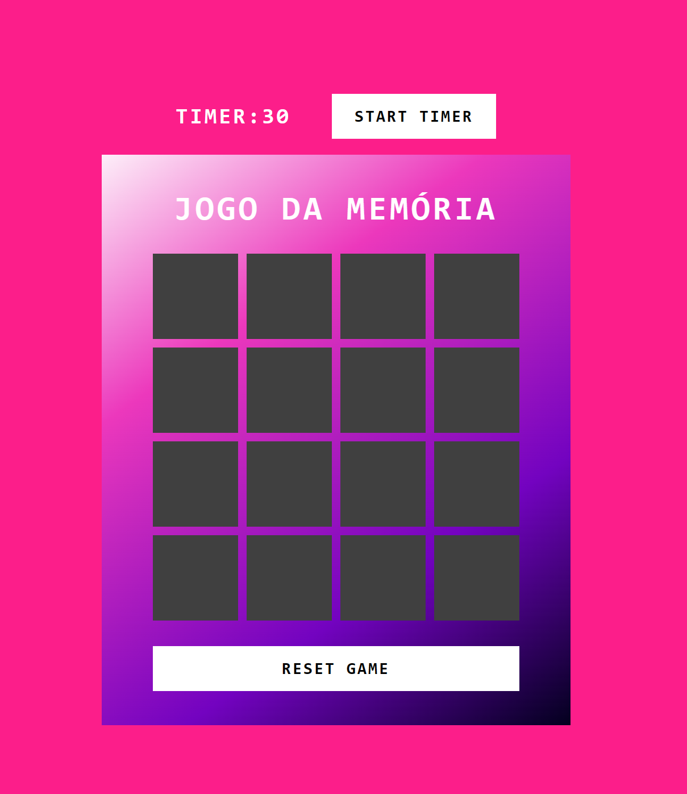
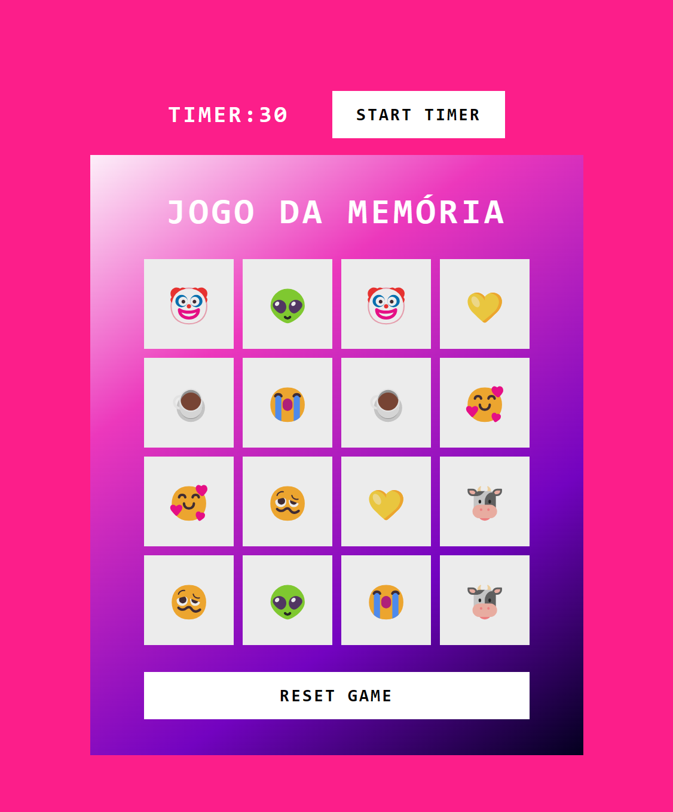

# Memory Game

In this repository you can find a cute memory game made only with a short HTML file, CSS and JavaScript.

## How to play 🧠

Like any other memory game you need to match two identical cards. Whenever you matched all the cards, you win/finished the game.  
I added a Timer in case you want to play against the time! ⏳ So all you need to do is press the button "Start Timer" and you'll have 30s to match the cards! :)

## Credits

This game is part of a bootcamp from [DIO](https://www.dio.me/en) and was developed during a lesson of [Felipe Aguiar](https://github.com/felipeAguiarCode).
